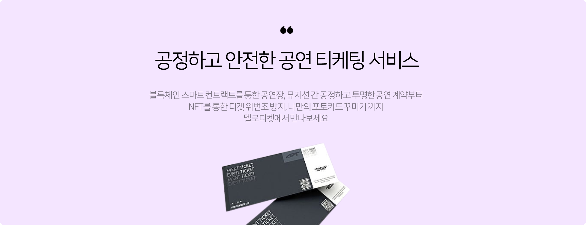
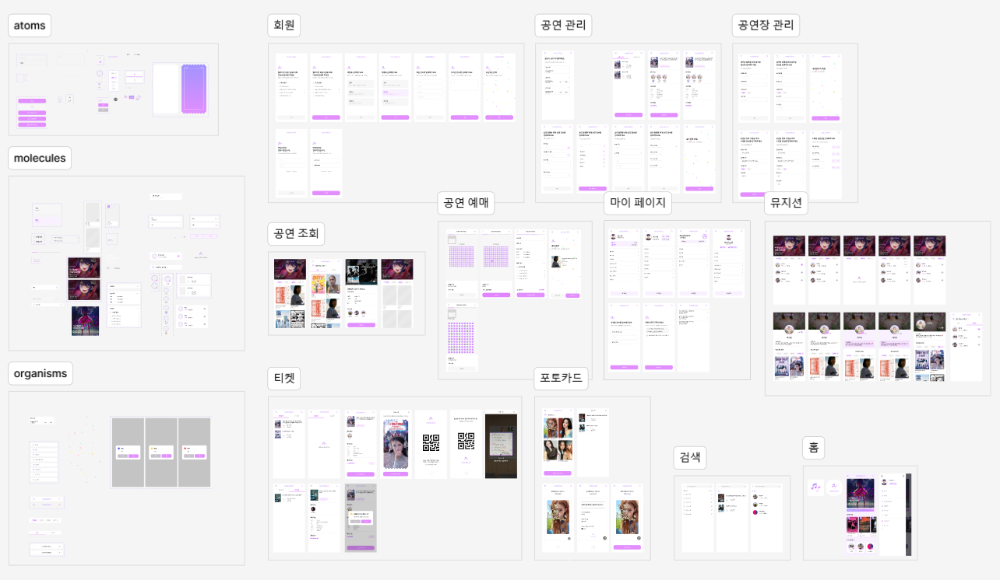

# 밴드 공연 티케팅 서비스, Melodiket 🎵

## 📅 프로젝트 정보

### SSAFY 11기 2학기 특화 프로젝트

**✨ 특화 프로젝트 우수팀 (반 1등) ✨**

2024.08.19(월) ~ 2024.10.11(금) [8주]

 

🍇💜🎶🎵🤩👾🎆🎉✨🎀🔮🪀

## 📖 주제

스마트 컨트랙트 기반 **밴드 공연 티케팅 서비스**

 

## 👨‍🎤 기획 배경

- 불투명, 불공정한 수익 분배로 인한 **뮤지션의 경제적 어려움**
  - [“내 관객 없으면 정산 0원?” 홍대 클럽에 무슨 일이](https://www.kukinews.com/article/view/kuk202302020173)
- 시스템과 현행법의 허점을 노려 **암표 피해자** 발생
  - [임영웅 콘서트 암표 '500만원' 치솟더니…'초강수' 꺼냈다](https://www.hankyung.com/article/2024091248037)

 

## 📱 서비스 소개

 

## 🔎 기술 스택

### 🐹 Frontend

  
  
  

  
  

  
  

 

### 🐸 Backend

  
  

  
  

  
  
  

 

### 🧱 Blockchain

  
  

 

### ☁ CI/CD

  
  

  
  
  

 

## 🗃️ 산출물

|                  |                                                     |
| :--------------: | --------------------------------------------------: |
|   Architecture   |      |
| Sequence Diagram |  |
|       ERD        |               |
|    Wireframe     |         |

 

## 🥝 팀원

<table>
  <thead>
    <tr>
      <th>Name</th>
      <th>Roles</th>
      <th>Development</th>
      <th>GitHub</th>
    </tr>
  </thead>
  <tbody>
    <tr>
      <td>정다빈 👑</td>
      <td>팀장, Frontend</td>
      <td>
        <ul>
          <li>MSW를 활용한 API Mocking 구축</li>
          <li>예매 내역 조회 및 티켓 사용/취소 구현</li>
          <li>모바일 티켓(QR) 생성 및 스캔 기능 구현</li>
          <li>NFT 포토카드 제작 및 카카오톡 공유 기능 구현</li>
          <li>뮤지션 조회 및 찜 기능 구현</li>
          <li>로그인/로그아웃 구현</li>
        </ul>
      </td>
      <td align=center><a href="https://github.com/allkong">@allkong</a></td>
    </tr>
    <tr>
      <td>강혁준 🥁</td>
      <td>Frontend</td>
      <td>
        <ul>
          <li>Carousel, Menu 컴포넌트 설계</li>
          <li>Funnel UI 커스텀 훅 구현</li>
          <li>클라이언트 무한 스크롤 구현</li>
        </ul>
      </td>
      <td align=center><a href="https://github.com/kanghyukjun">@kanghyukjun</a></td>
    </tr>
    <tr>
      <td>윤병서 🎤</td>
      <td>Frontend</td>
      <td>
        <ul>
          <li>프론트엔드 API 연동</li>
          <li>마이페이지, 공연장 및 공연 관리 기능 구현</li>
          <li>공연 계약 승인, 거절 및 취소 기능 구현</li>
        </ul>
      </td>
      <td align=center><a href="https://github.com/bsyun0571">@bsyun0571</a></td>
    </tr>
    <tr>
      <td>김경호 🎹</td>
      <td>Backend</td>
      <td>
        <ul>
          <li>ELK 기반 블록체인 트랜잭션 로그 수집/관리</li>
          <li>NFT 발급 기능 등 백엔드 API 개발</li>
          <li>Jenkins 기반 CI/CD 구축 및 관리</li>
        </ul>
      </td>
      <td align=center><a href="https://github.com/kkho9654">@kkho9654</a></td>
    </tr>
    <tr>
      <td>박세빈 🎥</td>
      <td>Backend</td>
      <td>
        <ul>
          <li>3-tier 아키텍처 설계/핵심 로직 구현</li>
          <li>Authentication/Error handling 구현</li>
          <li>공연 계약 주요 비즈니스 로직 구현</li>
        </ul>
      </td>
      <td align=center><a href="https://github.com/sevin98">@sevin98</a></td>
    </tr>
    <tr>
      <td>박유빈 🎸</td>
      <td>Backend</td>
      <td>
        <ul>
          <li>솔리디티 스마트 컨트랙트 및 클라이언트 개발</li>
          <li>IPFS 노드 서버 개발</li>
          <li>Redis 분산 락 기반 트랜잭션 처리 개발</li>
        </ul>
      </td>
      <td align=center><a href="https://github.com/pcjs156">@pcjs156</a></td>
    </tr>
  </tbody>
</table>
